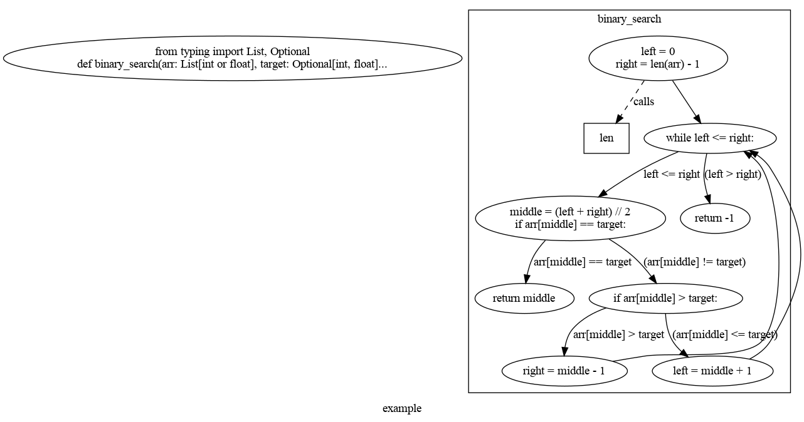

# Exploration-Control-Flow-Graph
_ _ _

## Introduction

[Control Flow Graph (CFG)]((https://habr.com/ru/articles/742798/)) is a graph where nodes represent basic blocks of code and edges represent transitions between them.
In static code analysis, CFG can be used to detect potential issues in the code.


## Insallation requirements

### Python packages

```bash
pip install -r requirements.txt
```

### Graphviz
Graphviz is also required. It can be installed from [here](https://graphviz.org/download/).

Ubuntu:
```bash
sudo apt install graphviz
```

## Usage

```bash
python src/main.py
```

### Output


